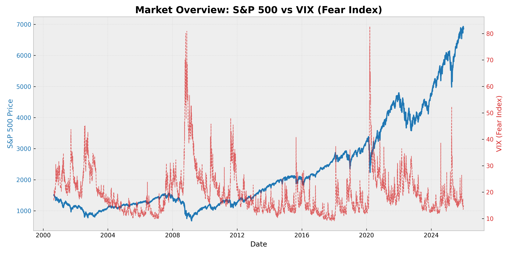

# Financial Crisis Early Warning System (FCEWS) 📉


> **"Predicting the unpredictable: A machine learning approach to macroeconomic risk management."**

## 👨‍💻 Project Overview
**Developed by Jihu**

This project is an advanced AI-powered system designed to detect early signs of financial market crashes. By analyzing complex correlations between macroeconomic indicators (Yield Spreads, VIX, Oil, Gold) and market movements, the model provides actionable warnings for risk management.

This project was inspired by and applies concepts from the **"AI for Business and Finance" Certification at Columbia Business School**, specifically focusing on the intersection of quantitative finance and data science.

## 💡 Motivation & Background
Traditional financial models often fail to capture non-linear relationships in market data. Leveraging the curriculum from **Columbia Business School**, this project bridges the gap between financial theory and modern AI implementation.

* **Objective:** To build a conservative "Early Warning System" that prioritizes precision over noise.
* **Methodology:** Utilizing **Random Forest Classifiers** with 'Class Weight Balancing' to address the scarcity of historical crisis events (Imbalanced Data Problem).

## 🛠 Key Features
* **Automated Data Pipeline:** Real-time data fetching from **Yahoo Finance** and **Federal Reserve Economic Data (FRED)**.
* **Macro-Financial Analysis:** Integrates the **10Y-2Y Treasury Yield Spread** (a leading recession indicator) with market volatility indices.
* **Lagged Feature Engineering:** Implements a 20-day predictive horizon to simulate real-world trading scenarios and prevent look-ahead bias.
* **Risk-Adjusted Modeling:** Optimized for high precision to minimize false alarms (preventing the "Boy Who Cried Wolf" scenario).

## 📊 Market Visualization
The system visualizes the historical relationship between Market Fear (VIX) and the S&P 500 Index to validate model logic.



## 🧠 Model Performance
The model has been rigorously tested on historical data from 2000 to the present.

* **Precision (Crisis Prediction):** **54%**
    * *Interpretation:* When the AI predicts a crisis, there is a >50% probability of a significant market drop (>5%) within the next month.
* **Strategy:** The model is tuned to be **conservative**. It prefers missing a weak signal rather than sending a false panic signal.

## 🚀 Getting Started

### Prerequisites
* Python 3.10 or higher
* Git

### Installation
1.  Clone the repository:
    ```bash
    git clone [https://github.com/jixxhx/Financial-Crisis-Early-Warning-System.git](https://github.com/jixxhx/Financial-Crisis-Early-Warning-System.git)
    ```
2.  Install dependencies:
    ```bash
    pip install pandas numpy yfinance pandas-datareader matplotlib scikit-learn
    ```

### Usage
1.  **Data Collection:**
    ```bash
    python data_collection.py
    ```
2.  **Visualization:**
    ```bash
    python data_visualization.py
    ```
3.  **Run AI Model:**
    ```bash
    python model_training.py
    ```

---
© 2026 Jihu. All Rights Reserved.
*Applied concepts from Columbia Business School Executive Education.*
